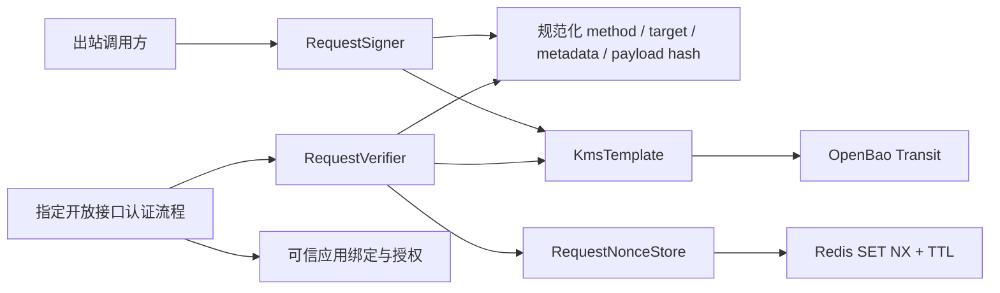

<!-- Generated by doc-sync-agent.py; sources: loadup-components/loadup-components-signature/README.md, loadup-components/loadup-components-signature/ARCHITECTURE.md -->

提供基于 OpenBao KMS 的请求签名协议，以及已有 JCA 签名/摘要工具。请求签名覆盖 HTTP 方法、path/query、timestamp、nonce、payload 摘要和可信应用上下文；服务端验签后使用原子 nonce 存储防重放。

## 能力矩阵

| 能力 | 契约 |
|------|------|
| 请求签名 | `RequestSigner` → `KmsTemplate`，私钥不进入应用；默认关闭 |
| 请求验签 | `RequestVerifier` → KMS，校验可信身份、算法/版本、时间、签名和 nonce |
| 算法 | RSA SHA-256 PKCS#1 v1.5 / PSS；沿用 KMS 算法与编码 |
| 报文 | 原始 path/query 和 payload 字节；不重排参数、不重新序列化 JSON |
| 防重放 | 默认复用已有 `StringRedisTemplate`；单条带 TTL 的 SET NX；可替换原子存储 SPI |
| 签名头 | 严格解析，大小受限，拒绝重复头、未知协议和非规范数字/Base64 |
| 可信身份 | 消费工程将应用、接收方、KMS 密钥名称/版本和算法绑定，验签不信任来路密钥选择 |
| 原有本地能力 | `SignatureService` / `KeyPairService` / `DigestService` 及静态工具继续提供 JCA 原语 |
| 不包含 | 自动保护全部 Controller、Spring Security 身份认证/授权、渠道原生签名、防重放之外的业务幂等 |

请求协议是 **LoadUp request v1**，不是完整 RFC 9421 实现。已有本地 JCA 服务不自动切换密钥所有权；请求协议通过独立门面调用 KMS，不接受本地私钥参数。

## Maven 接入

先导入 `loadup-dependencies` BOM：

```xml
<dependency>
    <groupId>io.github.loadup-cloud</groupId>
    <artifactId>loadup-components-signature</artifactId>
</dependency>
<!-- Receiving applications using the default replay store also include Redis. -->
<dependency>
    <groupId>org.springframework.boot</groupId>
    <artifactId>spring-boot-starter-data-redis</artifactId>
</dependency>
```

Signature 传递引入 KMS 和 HTTP；Redis 是可选依赖，消费工程按需添加。OpenBao 部署、运行令牌、SSL Bundle 及策略按 [KMS README](../kms/) 配置。

## 配置

```yaml
loadup:
  kms:
    enabled: true
    endpoint: https://openbao.internal:8200
    token-env: OPENBAO_TOKEN
  components:
    signature:
      enabled: true
      request:
        enabled: true
        verification-enabled: true
        max-age: 5m
        future-skew: 30s
        max-payload-bytes: 1048576
spring:
  data:
    redis:
      host: redis.internal
      port: 6379
```

开启请求协议需要 `KmsTemplate`。验签默认随请求协议启用，要求 `RequestNonceStore`：已有 `StringRedisTemplate` 时自动使用 Redis 实现；自定义 Bean 会覆盖它；两者都没有时启动失败。只签名出站请求时设置 `verification-enabled: false`，无需 Redis。不开启 `request.enabled` 时不装配这些新门面。

`max-age` 默认 5 分钟，允许 1 秒至 1 天；`future-skew` 默认 30 秒，允许 0 至 5 分钟；payload 默认 1 MiB、上限 16 MiB。这里只限制进入签名逻辑后的内容，HTTP 入口还必须限制读取大小。可注入 `Clock` 用于测试或统一时间来源，多实例须同步系统时间。

## LoadUp request v1 协议

### 签名元数据

| HTTP 头 | 内容 |
|---------|------|
| `X-Signature-Protocol` | 固定 `loadup-request-v1` |
| `X-App-Id` | 应用标识；服务端查找可信绑定，不是未经验签的认证结论 |
| `X-Signature-Audience` | 唯一接收服务标识，如 `acquiring-api` |
| `X-Key-Version` | 明确且大于 0 的密钥版本 |
| `X-Signature-Algorithm` | `RSA_SHA256_PKCS1` 或 `RSA_SHA256_PSS` |
| `X-Timestamp` | Unix 秒，十进制，无正号、空格或非必要前导零 |
| `X-Nonce` | 22–128 位 Base64URL 字符；生成器使用 24 个随机字节，输出 32 个字符 |
| `X-Signature` | 标准、带必要 padding 的 Base64 RSA 签名，禁止 Base64URL 替代 |

appId/audience 使用 1–128 位 `[A-Za-z0-9._:-]`。所有协议头只允许一个值；重复的大小写别名也拒绝。密钥名称不通过外部头传输，来自服务端受信映射。

### 签名原文

以下固定顺序、每行 LF（`\n`），**末尾也保留 LF**；UTF-8 编码交给 KMS。`payload-sha256` 是实际 payload 原始字节的 SHA-256 小写 Hex。

```text
loadup-request-v1
app-id:merchant-app
audience:acquiring-api
key-version:1
algorithm:RSA_SHA256_PKCS1
method:POST
path:/api/pay
query:?item=%2F&item=2
content-type:application/json
timestamp:1700000000
nonce:abcdefghijklmnopqrstuv
payload-sha256:4d4bbe59c6aad22442cde199a6a8a5f034405fcd78fb5a81c24ef249de1c45f1
```

这个测试向量的 payload 为 UTF-8 `{"amount":100}`，无 BOM 和尾部换行；nonce 仅供向量测试，实际客户端不得复用它。

- method 必须是大写 HTTP token，当前允许 1–16 个英文字母。
- target 为 origin-form 原始请求目标：例如 `/api/pay?item=%2F&item=2`。不包含 scheme、host 或 fragment；非 ASCII 字符先完成百分号编码。
- path 不解码、不整理斜线、不去掉 `/api`。query 保留开头 `?`、顺序、重复参数、空值和编码大小写。无 query 时该行为空；`/api/pay` 与 `/api/pay?` 不相同。
- Content-Type 只去掉两侧空格，原始控制字符拒绝，其他字符保持一致。缺失表示空字符串。入口必须拒绝重复或歧义的 Content-Type；不接受内容在代理或过滤器中被重编码后再验签。
- body 不做 JSON canonicalization。同义但不同空格、字段顺序、换行的 JSON 是不同 payload；空 body 为零字节，SHA-256 是其标准摘要。
- `RequestSignatureCanonicalizer.canonicalize` 可供 SDK 和跨语言互操作验证。摘要只出现在签名原文中，服务端自行计算，不接受客户端摘要替代原始 body。

### 签名调用

构造器注入 `RequestSigner`：

```java
RequestSigningIdentity identity = new RequestSigningIdentity(
        "merchant-app", "acquiring-api",
        new KmsKeyRef("merchant-key", 1),
        KmsSignatureAlgorithm.RSA_SHA256_PKCS1);
byte[] body = objectMapper.writeValueAsBytes(command);
RequestContent content = new RequestContent(
        "POST", "/api/pay", "application/json", body);
RequestSignature signed = requestSigner.sign(identity, content);
Map<String, String> headers = signed.toHeaders();
```

发送相同的 `body` 字节、target 和 Content-Type；不能签 DTO 后让另一套编码器重写 body。HTTP 组件的 `HttpCall` 支持直接传入 `byte[]`，可以对配置的固定操作路径签名：

```java
Map<String, String> headers = new HashMap<>(signed.toHeaders());
headers.put("Content-Type", content.contentType());
http.exchange("acquiring", "pay", new HttpCall(
        null, null, headers, content.payload()));
```

此例要求 `acquiring/pay` 的方法为 POST、最终路径为 `/api/pay`，且没有额外 query。有变量/query 时，签名必须在最终 URI 编码后进行，并保证发送 URI 完全相同；不能从未编码 Map 猜测最终字符串。HTTP 调用不负责自动插入签名。

密钥版本不能用 `latest`：原文要先包含确定版本，而且渠道/接收方需已认可该版本。轮换时明确选择已登记的新版本；服务端可从已授权版本列表选择相应绑定，不能任意信任头中的版本或算法。

### 服务端验签

构造器注入 `RequestVerifier`，在认证流程中取得**原始** method、request URI、query、Content-Type、body 和协议头：

```java
RequestSignature incoming = RequestSignature.fromHeaders(headersWithAllValues);
RequestSigningIdentity trusted = applicationBindings.requireAllowedBinding(
        incoming.parameters().appId(),
        incoming.parameters().keyVersion());
// The binding supplies the server's own audience and allowed algorithm/key.
RequestContent content = new RequestContent(method, rawTarget, contentType, rawBody);
requestVerifier.verify(trusted, content, incoming);
// Only after successful verification may the authenticated identity reach business code.
```

`headersWithAllValues` 类型为 `Map<String, List<String>>`；Spring 7 的 `HttpHeaders` 使用 `asMultiValueMap()` 转换，必须保留重复值，不能先用 `getHeader`/`toSingleValueMap` 隐藏重复头。绑定查询还须校验应用启停、租户范围和允许版本，接收方由服务配置决定。

验签成功无返回值；失败抛安全错误。验签顺序为：输入/身份校验 → 时间窗口 → KMS 验签 → 再检查时间 → 原子占用 nonce → 业务处理。业务失败不会释放 nonce；重试使用新 timestamp/nonce/签名，业务幂等键保持稳定。

组件不自动注册 Servlet Filter；消费工程将验签接入指定开放接口的 Spring Security 认证链，使用可重复读取的 bounded body wrapper，保留 Controller 方式。正常后台 JWT 接口不必强制使用请求签名。代理须保留外部签名 target；不能直接信任客户端提供的 `X-Forwarded-*` 或所谓原始路径头。

### 时间与防重放

接受条件：`timestamp <= now + futureSkew`，且 `now < timestamp + maxAge`。到期边界直接拒绝。nonce TTL 为到签名失效的剩余时间再加 `futureSkew`，为时钟较慢的其他节点保留余量；**允许未来时间戳时 TTL 可大于 maxAge**。部署须保证节点间时钟差不超过 `futureSkew`，设置 0 意味着不提供此余量。

Redis 使用 `loadup:signature:nonce:{sha256(appId + LF + audience + LF + nonce)}`，只存占位值，不存报文。TTL 向上取整到毫秒，避免提前过期。相同应用和接收方的 nonce 不因版本、算法或接口变化获得第二次使用机会。

`RequestNonceStore.claim` 必须原子创建并同时设置 TTL，存在返回 false，失败抛异常；不允许“先查再写”或普通 Spring Cache 的非原子模拟。多节点必须共享存储。专用 Redis 命名空间须避免提前驱逐、清空或主从故障丢失记录；高保证场景由消费工程选用满足持久性要求的原子存储，不能把 Redis 默认复制语义当成绝对一次性保证。

## 错误与验证

`RequestSignatureException.getCode()` 区分 `MALFORMED`、`IDENTITY_MISMATCH`、`EXPIRED`、`FUTURE_TIMESTAMP`、`INVALID_SIGNATURE`、`REPLAY`、`REPLAY_STORE_UNAVAILABLE`、`PAYLOAD_TOO_LARGE`。KMS 故障保持 `KmsException`，不当成普通不匹配；异常不携带 body、签名、凭证或存储 cause。消费工程将它们映射到认证失败或统一 JSON 报文，不在 Filter 中直接输出底层异常。

已提供固定规范化向量、KMS/JCA 互操作夹具、报文与元数据篡改、时间边界、并发防重放、存储故障、重复头及自动装配测试；尚未执行。本地 Redis 调用契约测试不替代真实 Redis/OpenBao 验收。

```shell
mvn clean -pl loadup-components/loadup-components-signature -am test \
  -Dtest=RequestSignatureTest,RequestSignatureAutoConfigurationTest,RedisRequestNonceStoreTest \
  -Dsurefire.failIfNoSpecifiedTests=false -Dskip.spotbugs=true -Dskip.spotless=true
```

## 原有本地工具

本地 JCA 调用仍通过 `SignatureService`、`KeyPairService`、`DigestService`、`SignatureUtils`、`DigestUtils`。旧 `loadup.components.signature.default-signature-algorithm`、`default-digest-algorithm`、`key-size` 配置保持其原有职责，不控制新请求协议。MD5/SHA-1 等历史摘要接口不作为请求认证方案。

设计和职责见 [ARCHITECTURE](./#architecture)，生产接入待办见 [ROADMAP](https://github.com/loadup-cloud/loadup-framework/blob/main/ROADMAP.md)。

---

<a id="architecture"></a>
## 设计与实现

### 职责与依赖

Signature 负责请求签名协议；KMS 负责密码操作和密钥版本；OpenBao 保管私钥。原有本地 JCA 工具仍是独立密码原语，不能替代请求协议的覆盖范围和防重放校验。



组件仍为单一 jar。请求协议硬依赖 KMS，与其共享 HTTP/Boot 技术栈；Redis Starter 是可选依赖，只在消费工程有 `StringRedisTemplate` 时装配存储适配器。没有新增数据库表或另一套密钥/商户管理平台。

### 小型调用接口

- `RequestSigner.sign(identity, content)` 自动生成时间与随机 nonce，返回可发送的签名头。
- `RequestVerifier.verify(trustedIdentity, content, signature)` 完成校验和 nonce 消费；只有正常返回才允许进入业务。
- `RequestSigningIdentity` 由业务绑定提供名称、明确版本、允许算法和接收方；客户端元数据不是受信身份。
- `RequestContent` 保存实际原始请求目标与字节，防御性复制，不依赖 Servlet。
- `RequestSignatureParameters` 及 `RequestSignature` 表达版本化协议，不在通用业务 DTO 中塞入签名字段。
- `RequestNonceStore` 是唯一存储 seam，其契约要求跨实例原子占位和 TTL；Redis 是现有 Spring Data Redis 的小型 Adapter。

签名和验签分别装配：出站签名无需 nonce 后端；接收验签缺少后端时启动失败。自定义 Store 覆盖默认 Redis 实现，业务不可提供“总是成功”的占位实现用于生产。

### 协议决策

首版明确为 LoadUp request v1 固定协议，不声称实现完整 [RFC 9421](https://www.rfc-editor.org/rfc/rfc9421.html)。参考 HTTP 消息签名关于覆盖内容、时间和上下文的安全要求；组件的字段、头名称和编码以 README 的固定向量为准。

不对 query Map 排序，因为解码、重复参数、`+`/`%20` 和编码差异可能引起解释不一致；签实际发送的 raw target。不解析 JSON，因为解析后重新序列化会失去原始内容。body 先 SHA-256，整个规范原文再交给 KMS 执行 RSA SHA-256，不将 body 摘要误作为完整签名原文。

固定顺序、标签与 LF（包括尾部 LF）避免串联歧义，所有行字段禁止原始换行。协议、appId、audience、版本、算法也进入签名，防止修改路由上下文或算法选择。唯一 audience 约束接收服务，减少相同密钥跨服务部署的误用；它不代替 TLS 或业务授权。

Content-Type 纳入签名，body 处理方式不能被任意改变。未覆盖的 HTTP 头不能用于决定业务权限、租户或改变报文含义；影响业务的参数放入签名 body/target 或通过认证身份确定。内容编码/代理重写须在消费工程规定并测试，首版按最终交给业务处理的相同原始内容验签。

明确版本是前置条件：签名前必须知道版本以将其纳入原文。KMS 不缓存最新版本，本协议不擅自轮换/选择 latest；应用需协调接收方公钥登记和允许版本列表。

### 安全执行顺序

1. 验证头结构、大小、唯一性、原始内容和受信绑定。
2. 先拒绝过期/过远未来请求，减少无效 KMS 调用。
3. 通过可信密钥及允许算法验签；正常不匹配与 KMS 不可用分开处理。
4. KMS 调用后再次检查时间，计算到 `timestamp + maxAge` 的剩余时间，额外加 futureSkew 作为节点时钟差的保留余量。
5. 根据应用、接收方、nonce 的摘要原子占位。重复或存储失败拒绝，成功后才进入业务。

不能在验签前占 nonce，否则攻击者能抢占合法 nonce。不能只保存固定 maxAge，因为未来时间戳的有效终点更晚。不能在事务回滚/业务失败时删除 nonce；防重放与订单幂等是不同语义，重试新签名但保持原业务幂等键。

部署要求节点时钟差不超过 futureSkew；该余量不改变签名过期边界，但防止较快节点先释放 nonce 而较慢节点仍接受旧签名。Redis 对 TTL 向上取整到毫秒；`setIfAbsent` 必须即时返回，事务/流水线导致 null 视为故障。Redis 实例的驱逐、持久性和故障切换语义由部署保障，组件不声称解决集群记录丢失；严格持久防重放可实现相同 Store 契约。

### 自动装配与 Web 集成

`loadup.components.signature.request.enabled=true` 后，在 KMS 和 Redis 自动配置之后创建签名门面。默认启用接收验签；`verification-enabled=false` 用于纯客户端。未启用请求协议时，原有 JCA 装配照常工作。

保持 Servlet 和 Spring Security 接入在消费工程：这里不知道哪些接口是开放接口、appid 对应谁、租户授权关系或代理真实路径。自动全局 Filter 会意外改变 JWT 后台接口，因此组件不注册它。接入流程应在 Controller 前完成验签、建立认证身份，并提供受限且可重复读取的原始 body；错误由入口认证适配层映射成项目 JSON 契约。

HTTP 组件可发送签名后的原始字节。含变量/query 的请求必须在最终编码后签名；当前没有不透明的全局 HTTP 签名拦截器，不隐藏调用方实际签署的内容。

### 验证与后续

测试通过公开门面覆盖固定规范化向量、字段篡改、JCA/RSA 与 PSS 互操作、时间边界、原子 nonce 并发、失败关闭、重复头与有/无 Redis 的装配。测试尚未执行；内存原子夹具和 Redis Mockito 契约不证明真实 Redis 的并发与 TTL 行为。

后续以真实消费工程验证 OpenBao、Redis、多实例时间、代理 target、原始 body wrapper 和入口错误映射，按明确开放接口需求接入 Spring Security。若跨组织互操作明确要求 RFC 9421，使用经过评估的标准实现新增协议版本，不悄然改变 v1 字节规范。

接入方式见 [README](./)，待办见 [ROADMAP](https://github.com/loadup-cloud/loadup-framework/blob/main/ROADMAP.md)。
