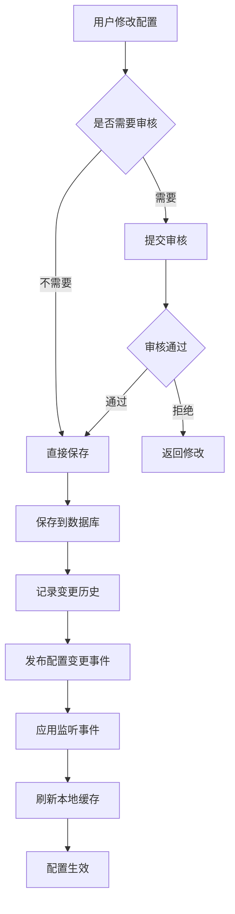

# LoadUp Config 配置管理模块 - 设计方案

> **版本**: v1.0  
> **创建日期**: 2026-02-28  
> **模块代号**: loadup-modules-config  
> **优先级**: 🔴 P0

## 📋 目录

- [1. 模块概述](#1-模块概述)
- [2. 功能设计](#2-功能设计)
- [3. 架构设计](#3-架构设计)
- [4. 数据模型设计](#4-数据模型设计)
- [5. API 设计](#5-api-设计)
- [6. 技术实现](#6-技术实现)
- [7. 安全设计](#7-安全设计)
- [8. 性能优化](#8-性能优化)
- [9. 测试方案](#9-测试方案)
- [10. 实施计划](#10-实施计划)

---

## 1. 模块概述

### 1.1 业务价值

Config 配置管理模块是整个系统的基础支撑模块，提供：

- **系统参数管理**: 运行时可修改的系统配置
- **数据字典管理**: 业务枚举值的集中管理
- **配置版本控制**: 配置变更历史追溯和回滚
- **配置热更新**: 无需重启即可生效的配置变更
- **配置分发**: 配置变更的事件通知机制

### 1.2 核心特性

| 特性     | 说明                    | 优先级 |
|--------|-----------------------|-----|
| 系统参数管理 | key-value 配置，支持多种数据类型 | P0  |
| 数据字典管理 | 分类字典、级联字典             | P0  |
| 配置热更新  | 基于事件机制的自动刷新           | P0  |
| 配置加密   | 敏感配置加密存储              | P1  |
| 配置版本管理 | 变更历史和回滚               | P1  |
| 配置导入导出 | JSON/YAML 格式          | P2  |
| 配置审计   | 变更日志记录                | P1  |

### 1.3 非功能需求

- **性能**: 配置读取 < 10ms (本地缓存)
- **可用性**: 99.9%+
- **并发**: 支持 10000+ QPS 查询
- **数据一致性**: 最终一致性
- **扩展性**: 支持自定义配置类型

---

## 2. 功能设计

### 2.1 系统参数管理

#### 功能列表

```
系统参数管理
├─ 参数分组
│  ├─ 按业务模块分组 (system/security/upload/email...)
│  └─ 分组树形结构
├─ 参数类型
│  ├─ STRING (字符串)
│  ├─ INTEGER (整数)
│  ├─ LONG (长整数)
│  ├─ DOUBLE (浮点数)
│  ├─ BOOLEAN (布尔值)
│  └─ JSON (JSON对象/数组)
├─ 参数管理
│  ├─ 新增参数
│  ├─ 修改参数值
│  ├─ 删除参数
│  └─ 批量操作
└─ 参数查询
   ├─ 按 key 查询
   ├─ 按分组查询
   └─ 模糊搜索
```

#### 核心场景

**场景1: 上传文件大小限制**

```java
// 配置定义
key: upload.max-file-size
value: 10485760
type: LONG
category: upload
description: 文件上传大小限制(字节)
editable: true
```

**场景2: 邮件服务配置**

```java
// 配置定义
key: email.smtp.config
value: {"host":"smtp.qq.com","port":587,"username":"admin@example.com"}
type: JSON
category: email
encrypted: true
```

### 2.2 数据字典管理

#### 功能列表

```
数据字典管理
├─ 字典类型
│  ├─ 新增类型
│  ├─ 修改类型
│  ├─ 删除类型
│  └─ 启用/停用
├─ 字典项
│  ├─ 新增字典项
│  ├─ 修改字典项
│  ├─ 删除字典项
│  ├─ 排序
│  └─ 启用/停用
├─ 级联字典
│  ├─ 父子关系定义
│  └─ 树形结构
└─ 字典查询
   ├─ 按类型查询
   ├─ 级联查询
   └─ 缓存优化
```

#### 核心场景

**场景1: 用户状态字典**

```java
// 字典类型
code: user_status
name: 用户状态
system: true

// 字典项
{label: "正常", value: "1", sort: 1},
{label: "停用", value: "0", sort: 2},
{label: "锁定", value: "2", sort: 3}
```

**场景2: 地区级联字典**

```java
// 省份
{label: "北京市", value: "110000", parentValue: null}
// 城市
{label: "北京市", value: "110100", parentValue: "110000"}
// 区县
{label: "东城区", value: "110101", parentValue: "110100"}
```

### 2.3 配置变更管理

#### 变更流程



---

## 3. 架构设计

### 3.1 分层架构 (COLA 4.0，无 adapter)

> ⚠️ 本项目通过 LoadUp Gateway `bean://` 协议直接调用 App 层 @Service，**不需要也不应该创建 Controller**。

```
loadup-modules-config/
├─ loadup-modules-config-client/          # 客户端层（对外暴露）
│  └─ src/main/java/
│     └─ io/github/loadup/modules/config/client/
│        ├─ dto/
│        │  ├─ ConfigItemDTO.java         ✅
│        │  ├─ DictTypeDTO.java           ✅
│        │  └─ DictItemDTO.java           ✅
│        └─ command/
│           ├─ ConfigItemCreateCommand.java  ✅
│           ├─ ConfigItemUpdateCommand.java  ✅
│           ├─ DictTypeCreateCommand.java    ✅
│           └─ DictItemCreateCommand.java    ✅
│
├─ loadup-modules-config-domain/          # 领域层（纯 POJO，无框架注解）
│  └─ src/main/java/
│     └─ io/github/loadup/modules/config/domain/
│        ├─ model/
│        │  ├─ ConfigItem.java            ✅
│        │  ├─ DictType.java              ✅
│        │  └─ DictItem.java              ✅
│        ├─ gateway/
│        │  ├─ ConfigItemGateway.java     ✅
│        │  └─ DictGateway.java           ✅
│        └─ enums/
│           └─ ValueType.java             ✅
│
├─ loadup-modules-config-infrastructure/   # 基础设施层
│  └─ src/main/java/
│     └─ io/github/loadup/modules/config/infrastructure/
│        ├─ dataobject/
│        │  ├─ ConfigItemDO.java          ✅
│        │  ├─ DictTypeDO.java            ✅
│        │  ├─ DictItemDO.java            ✅
│        │  └─ table/                     ✅ (APT 生成)
│        ├─ mapper/                        ✅ (APT 生成)
│        ├─ converter/
│        │  ├─ ConfigItemConverter.java   ✅ (MapStruct)
│        │  └─ DictConverter.java         ✅ (MapStruct)
│        ├─ repository/
│        │  ├─ ConfigItemGatewayImpl.java ✅
│        │  └─ DictGatewayImpl.java       ✅
│        └─ cache/
│           └─ ConfigLocalCache.java      ✅ (Caffeine, 5min TTL)
│
├─ loadup-modules-config-app/             # 应用层
│  └─ src/main/java/
│     └─ io/github/loadup/modules/config/app/
│        ├─ service/
│        │  ├─ ConfigItemService.java     ✅
│        │  └─ DictService.java           ✅
│        └─ autoconfigure/
│           └─ ConfigModuleAutoConfiguration.java  ✅
│
└─ loadup-modules-config-test/            # 集成测试
   └─ src/test/java/
      └─ io/github/loadup/modules/config/
         ├─ ConfigItemServiceIT.java      ✅ (7 cases)
         └─ DictServiceIT.java            ✅ (7 cases)
```

### Gateway 路由配置（待完善）

通过 `loadup-application/src/main/resources/gateway-config/routes.csv` 注册，**无需 Controller**：

```
# 系统参数
/api/v1/config/list,POST,bean://configItemService:listAll,default,,,true,
/api/v1/config/create,POST,bean://configItemService:create,default,,,true,
/api/v1/config/update,POST,bean://configItemService:update,default,,,true,
/api/v1/config/delete,POST,bean://configItemService:delete,default,,,true,
/api/v1/config/value,POST,bean://configItemService:getValue,OFF,,,true,
/api/v1/config/refresh-cache,POST,bean://configItemService:refreshCache,default,,,true,
# 数据字典
/api/v1/dict/types,POST,bean://dictService:listAllTypes,default,,,true,
/api/v1/dict/data,POST,bean://dictService:getDictData,OFF,,,true,
/api/v1/dict/cascade,POST,bean://dictService:getCascadeData,OFF,,,true,
/api/v1/dict/label,POST,bean://dictService:getDictLabel,OFF,,,true,
/api/v1/dict/type/create,POST,bean://dictService:createType,default,,,true,
/api/v1/dict/type/delete,POST,bean://dictService:deleteType,default,,,true,
/api/v1/dict/item/create,POST,bean://dictService:createItem,default,,,true,
/api/v1/dict/item/delete,POST,bean://dictService:deleteItem,default,,,true,
```

### 3.2 核心组件

#### 3.2.1 配置客户端

```java
/**
 * 配置客户端 - 供业务代码使用
 */
@Component
public class ConfigClient {
    
    private final ConfigCacheManager cacheManager;
    private final ConfigRepository repository;
    
    /**
     * 获取配置值（泛型支持）
     */
    public <T> T getValue(String key, Class<T> type) {
        return getValue(key, type, null);
    }
    
    /**
     * 获取配置值（带默认值）
     */
    public <T> T getValue(String key, Class<T> type, T defaultValue) {
        // 1. 从缓存获取
        Config config = cacheManager.get(key);
        if (config == null) {
            // 2. 从数据库加载
            config = repository.findByKey(key)
                .orElse(null);
            if (config != null) {
                cacheManager.put(key, config);
            }
        }
        
        // 3. 类型转换
        if (config != null) {
            return config.getValue().convertTo(type);
        }
        
        return defaultValue;
    }
    
    /**
     * 监听配置变更
     */
    public void listen(String key, ConfigChangeListener listener) {
        // 注册监听器
    }
}
```

#### 3.2.2 配置注解支持

```java
/**
 * 配置值注入注解
 */
@Target(ElementType.FIELD)
@Retention(RetentionPolicy.RUNTIME)
public @interface ConfigValue {
    /**
     * 配置键
     */
    String value();
    
    /**
     * 默认值
     */
    String defaultValue() default "";
    
    /**
     * 是否自动刷新
     */
    boolean autoRefresh() default true;
}

// 使用示例
@Component
public class UploadService {
    
    @ConfigValue("upload.max-file-size")
    private Long maxFileSize;  // 自动注入并刷新
    
    public void uploadFile(MultipartFile file) {
        if (file.getSize() > maxFileSize) {
            throw new BusinessException("文件过大");
        }
    }
}
```

---

## 4. 数据模型设计

### 4.1 数据库表设计

#### 4.1.1 系统参数表 (config_item)

```sql
CREATE TABLE config_item (
    id VARCHAR(64) NOT NULL COMMENT '主键',
    config_key VARCHAR(200) NOT NULL COMMENT '配置键',
    config_value TEXT COMMENT '配置值',
    value_type VARCHAR(20) NOT NULL DEFAULT 'STRING' COMMENT '值类型: STRING/INTEGER/LONG/DOUBLE/BOOLEAN/JSON',
    category VARCHAR(50) NOT NULL DEFAULT 'default' COMMENT '分类',
    description VARCHAR(500) COMMENT '描述',
    editable BOOLEAN NOT NULL DEFAULT TRUE COMMENT '是否可编辑',
    encrypted BOOLEAN NOT NULL DEFAULT FALSE COMMENT '是否加密',
    system_defined BOOLEAN NOT NULL DEFAULT FALSE COMMENT '是否系统定义',
    sort_order INT NOT NULL DEFAULT 0 COMMENT '排序',
    enabled BOOLEAN NOT NULL DEFAULT TRUE COMMENT '是否启用',
    created_by VARCHAR(64) COMMENT '创建人',
    created_at DATETIME NOT NULL  COMMENT '创建时间',
    updated_by VARCHAR(64) COMMENT '更新人',
    updated_at DATETIME NOT NULL  ON UPDATE CURRENT_TIMESTAMP COMMENT '更新时间',
    PRIMARY KEY (id),
    UNIQUE KEY uk_config_key (config_key),
    KEY idx_category (category),
    KEY idx_enabled (enabled)
) ENGINE=InnoDB DEFAULT CHARSET=utf8mb4 COLLATE=utf8mb4_unicode_ci COMMENT='系统参数配置表';

-- 初始数据
INSERT INTO config_item (id, config_key, config_value, value_type, category, description, system_defined) VALUES
('1', 'system.name', 'LoadUp Framework', 'STRING', 'system', '系统名称', TRUE),
('2', 'upload.max-file-size', '10485760', 'LONG', 'upload', '文件上传大小限制(字节)', FALSE),
('3', 'security.password-expire-days', '90', 'INTEGER', 'security', '密码过期天数', FALSE),
('4', 'cache.default-ttl', '3600', 'INTEGER', 'cache', '默认缓存过期时间(秒)', FALSE);
```

#### 4.1.2 数据字典类型表 (dict_type)

```sql
CREATE TABLE dict_type (
    id VARCHAR(64) NOT NULL COMMENT '主键',
    dict_code VARCHAR(100) NOT NULL COMMENT '字典编码',
    dict_name VARCHAR(200) NOT NULL COMMENT '字典名称',
    description VARCHAR(500) COMMENT '描述',
    system_defined BOOLEAN NOT NULL DEFAULT FALSE COMMENT '是否系统定义',
    sort_order INT NOT NULL DEFAULT 0 COMMENT '排序',
    enabled BOOLEAN NOT NULL DEFAULT TRUE COMMENT '是否启用',
    created_by VARCHAR(64) COMMENT '创建人',
    created_at DATETIME NOT NULL  COMMENT '创建时间',
    updated_by VARCHAR(64) COMMENT '更新人',
    updated_at DATETIME NOT NULL  ON UPDATE CURRENT_TIMESTAMP COMMENT '更新时间',
    PRIMARY KEY (id),
    UNIQUE KEY uk_dict_code (dict_code),
    KEY idx_enabled (enabled)
) ENGINE=InnoDB DEFAULT CHARSET=utf8mb4 COLLATE=utf8mb4_unicode_ci COMMENT='数据字典类型表';

-- 初始数据
INSERT INTO dict_type (id, dict_code, dict_name, system_defined) VALUES
('1', 'user_status', '用户状态', TRUE),
('2', 'gender', '性别', TRUE),
('3', 'yes_no', '是否', TRUE);
```

#### 4.1.3 数据字典项表 (dict_item)

```sql
CREATE TABLE dict_item (
    id VARCHAR(64) NOT NULL COMMENT '主键',
    dict_code VARCHAR(100) NOT NULL COMMENT '字典编码',
    item_label VARCHAR(200) NOT NULL COMMENT '字典标签',
    item_value VARCHAR(200) NOT NULL COMMENT '字典值',
    parent_value VARCHAR(200) COMMENT '父级值(级联字典)',
    description VARCHAR(500) COMMENT '描述',
    sort_order INT NOT NULL DEFAULT 0 COMMENT '排序',
    enabled BOOLEAN NOT NULL DEFAULT TRUE COMMENT '是否启用',
    css_class VARCHAR(100) COMMENT 'CSS类名',
    list_class VARCHAR(100) COMMENT '列表样式类',
    created_by VARCHAR(64) COMMENT '创建人',
    created_at DATETIME NOT NULL  COMMENT '创建时间',
    updated_by VARCHAR(64) COMMENT '更新人',
    updated_at DATETIME NOT NULL  ON UPDATE CURRENT_TIMESTAMP COMMENT '更新时间',
    PRIMARY KEY (id),
    UNIQUE KEY uk_dict_code_value (dict_code, item_value),
    KEY idx_dict_code (dict_code),
    KEY idx_parent_value (parent_value),
    KEY idx_enabled (enabled)
) ENGINE=InnoDB DEFAULT CHARSET=utf8mb4 COLLATE=utf8mb4_unicode_ci COMMENT='数据字典项表';

-- 初始数据
INSERT INTO dict_item (id, dict_code, item_label, item_value, sort_order) VALUES
('1', 'user_status', '正常', '1', 1),
('2', 'user_status', '停用', '0', 2),
('3', 'user_status', '锁定', '2', 3),
('4', 'gender', '男', '1', 1),
('5', 'gender', '女', '2', 2),
('6', 'gender', '未知', '0', 3),
('7', 'yes_no', '是', '1', 1),
('8', 'yes_no', '否', '0', 2);
```

#### 4.1.4 配置变更历史表 (config_history)

```sql
CREATE TABLE config_history (
    id VARCHAR(64) NOT NULL COMMENT '主键',
    config_key VARCHAR(200) NOT NULL COMMENT '配置键',
    old_value TEXT COMMENT '旧值',
    new_value TEXT COMMENT '新值',
    change_type VARCHAR(20) NOT NULL COMMENT '变更类型: CREATE/UPDATE/DELETE',
    operator VARCHAR(64) NOT NULL COMMENT '操作人',
    operation_time DATETIME NOT NULL  COMMENT '操作时间',
    remark VARCHAR(500) COMMENT '备注',
    PRIMARY KEY (id),
    KEY idx_config_key (config_key),
    KEY idx_operation_time (operation_time)
) ENGINE=InnoDB DEFAULT CHARSET=utf8mb4 COLLATE=utf8mb4_unicode_ci COMMENT='配置变更历史表';
```

### 4.2 领域模型

#### 4.2.1 Config 配置实体

```java
/**
 * 配置聚合根
 */
@Data
@Builder
public class Config {
    private String id;
    private String key;
    private ConfigValue value;
    private ConfigType type;
    private String category;
    private String description;
    private Boolean editable;
    private Boolean encrypted;
    private Boolean systemDefined;
    private Integer sortOrder;
    private Boolean enabled;
    
    /**
     * 修改配置值（领域行为）
     */
    public void changeValue(String newValue, String operator) {
        if (!editable) {
            throw new BusinessException("配置不可编辑");
        }
        
        // 记录历史
        ConfigHistory history = ConfigHistory.builder()
            .configKey(this.key)
            .oldValue(this.value.getRawValue())
            .newValue(newValue)
            .changeType(ChangeType.UPDATE)
            .operator(operator)
            .build();
        
        // 更新值
        this.value = ConfigValue.of(newValue, this.type);
        
        // 发布领域事件
        DomainEventPublisher.publish(
            new ConfigChangedEvent(this.key, this.value, operator)
        );
    }
    
    /**
     * 启用配置
     */
    public void enable() {
        this.enabled = true;
    }
    
    /**
     * 停用配置
     */
    public void disable() {
        this.enabled = false;
    }
}
```

#### 4.2.2 ConfigValue 值对象

```java
/**
 * 配置值对象（不可变）
 */
@Value
public class ConfigValue {
    String rawValue;
    ConfigType type;
    
    public static ConfigValue of(String rawValue, ConfigType type) {
        return new ConfigValue(rawValue, type);
    }
    
    /**
     * 类型转换
     */
    @SuppressWarnings("unchecked")
    public <T> T convertTo(Class<T> targetType) {
        if (rawValue == null) {
            return null;
        }
        
        return switch (type) {
            case STRING -> (T) rawValue;
            case INTEGER -> (T) Integer.valueOf(rawValue);
            case LONG -> (T) Long.valueOf(rawValue);
            case DOUBLE -> (T) Double.valueOf(rawValue);
            case BOOLEAN -> (T) Boolean.valueOf(rawValue);
            case JSON -> (T) JsonUtils.parseObject(rawValue, targetType);
        };
    }
}
```

---

## 5. API 设计

> ⚠️ 本项目通过 LoadUp Gateway `bean://beanName:method` 协议暴露 API，**无 Controller 层**。

### 5.1 Gateway 路由（routes.csv）

所有接口通过 `loadup-application/src/main/resources/gateway-config/routes.csv` 配置：

| 路径                                | 方法   | Target Bean                               | securityCode | 说明         |
|-----------------------------------|------|-------------------------------------------|--------------|------------|
| `/api/v1/config/list`             | POST | `bean://configItemService:listAll`        | `default`    | 查询参数列表     |
| `/api/v1/config/list-by-category` | POST | `bean://configItemService:listByCategory` | `default`    | 按分类查询      |
| `/api/v1/config/get`              | POST | `bean://configItemService:getByKey`       | `default`    | 按 Key 查询   |
| `/api/v1/config/value`            | POST | `bean://configItemService:getValue`       | `OFF`        | 获取原始值（公开）  |
| `/api/v1/config/create`           | POST | `bean://configItemService:create`         | `default`    | 创建参数       |
| `/api/v1/config/update`           | POST | `bean://configItemService:update`         | `default`    | 更新参数       |
| `/api/v1/config/delete`           | POST | `bean://configItemService:delete`         | `default`    | 删除参数       |
| `/api/v1/config/refresh-cache`    | POST | `bean://configItemService:refreshCache`   | `default`    | 刷新缓存       |
| `/api/v1/dict/types`              | POST | `bean://dictService:listAllTypes`         | `default`    | 查询字典类型列表   |
| `/api/v1/dict/data`               | POST | `bean://dictService:getDictData`          | `OFF`        | 获取字典数据（公开） |
| `/api/v1/dict/cascade`            | POST | `bean://dictService:getCascadeData`       | `OFF`        | 获取级联字典数据   |
| `/api/v1/dict/label`              | POST | `bean://dictService:getDictLabel`         | `OFF`        | 获取字典标签（公开） |
| `/api/v1/dict/type/create`        | POST | `bean://dictService:createType`           | `default`    | 创建字典类型     |
| `/api/v1/dict/type/delete`        | POST | `bean://dictService:deleteType`           | `default`    | 删除字典类型     |
| `/api/v1/dict/item/create`        | POST | `bean://dictService:createItem`           | `default`    | 创建字典项      |
| `/api/v1/dict/item/delete`        | POST | `bean://dictService:deleteItem`           | `default`    | 删除字典项      |

### 5.2 Service 方法签名（直接由 Gateway 调用）

```java
// ConfigItemService — bean://configItemService:method
public List<ConfigItemDTO> listAll()
public List<ConfigItemDTO> listByCategory(String category)
public ConfigItemDTO getByKey(String configKey)
public String getValue(String configKey)
public <T> T getTypedValue(String configKey, Class<T> targetType, T defaultValue)
public String create(@Valid ConfigItemCreateCommand cmd)
public void update(@Valid ConfigItemUpdateCommand cmd)
public void delete(String configKey)
public void refreshCache()

// DictService — bean://dictService:method
public List<DictTypeDTO> listAllTypes()
public List<DictItemDTO> getDictData(String dictCode)
public List<DictItemDTO> getCascadeData(String dictCode, String parentValue)
public String getDictLabel(String dictCode, String itemValue)
public String createType(@Valid DictTypeCreateCommand cmd)
public void deleteType(String dictCode)
public String createItem(@Valid DictItemCreateCommand cmd)
public void deleteItem(String id)
```

---

## 6. 技术实现

### 6.1 配置缓存实现

```java
/**
 * 配置缓存管理器
 * 
 * 缓存策略:
 * - L1: Caffeine 本地缓存 (1分钟TTL)
 * - L2: Redis 分布式缓存 (10分钟TTL)
 */
@Component
public class ConfigCacheManager {
    
    private final Cache<String, Config> localCache;
    private final RedisTemplate<String, Config> redisTemplate;
    
    public ConfigCacheManager() {
        this.localCache = Caffeine.newBuilder()
            .maximumSize(1000)
            .expireAfterWrite(Duration.ofMinutes(1))
            .build();
    }
    
    /**
     * 获取配置（两级缓存）
     */
    public Config get(String key) {
        // L1: 本地缓存
        Config config = localCache.getIfPresent(key);
        if (config != null) {
            return config;
        }
        
        // L2: Redis缓存
        String redisKey = "config:" + key;
        config = redisTemplate.opsForValue().get(redisKey);
        if (config != null) {
            localCache.put(key, config);
            return config;
        }
        
        return null;
    }
    
    /**
     * 放入缓存
     */
    public void put(String key, Config config) {
        localCache.put(key, config);
        String redisKey = "config:" + key;
        redisTemplate.opsForValue().set(redisKey, config, Duration.ofMinutes(10));
    }
    
    /**
     * 删除缓存
     */
    public void evict(String key) {
        localCache.invalidate(key);
        redisTemplate.delete("config:" + key);
    }
    
    /**
     * 清空所有缓存
     */
    public void clear() {
        localCache.invalidateAll();
        Set<String> keys = redisTemplate.keys("config:*");
        if (keys != null && !keys.isEmpty()) {
            redisTemplate.delete(keys);
        }
    }
}
```

### 6.2 配置热更新实现

```java
/**
 * 配置变更事件监听器
 */
@Component
@Slf4j
public class ConfigChangeEventListener {
    
    private final ConfigCacheManager cacheManager;
    private final Map<String, List<ConfigChangeListener>> listeners = new ConcurrentHashMap<>();
    
    /**
     * 监听配置变更事件
     */
    @EventListener
    public void onConfigChanged(ConfigChangedEvent event) {
        String key = event.getKey();
        log.info("配置变更: key={}, newValue={}, operator={}", 
            key, event.getNewValue(), event.getOperator());
        
        // 1. 刷新缓存
        cacheManager.evict(key);
        
        // 2. 通知监听器
        List<ConfigChangeListener> keyListeners = listeners.get(key);
        if (keyListeners != null) {
            keyListeners.forEach(listener -> {
                try {
                    listener.onChange(event);
                } catch (Exception e) {
                    log.error("配置变更监听器执行失败: key={}", key, e);
                }
            });
        }
    }
    
    /**
     * 注册监听器
     */
    public void addListener(String key, ConfigChangeListener listener) {
        listeners.computeIfAbsent(key, k -> new CopyOnWriteArrayList<>())
            .add(listener);
    }
}
```

### 6.3 配置加密实现

```java
/**
 * 配置加密器
 * 
 * 使用 AES-256-GCM 加密敏感配置
 */
@Component
public class ConfigEncryptor {
    
    private final SecretKey secretKey;
    
    public ConfigEncryptor(@Value("${config.encrypt.key}") String key) {
        this.secretKey = deriveKey(key);
    }
    
    /**
     * 加密
     */
    public String encrypt(String plaintext) {
        try {
            Cipher cipher = Cipher.getInstance("AES/GCM/NoPadding");
            byte[] iv = generateIV();
            GCMParameterSpec spec = new GCMParameterSpec(128, iv);
            cipher.init(Cipher.ENCRYPT_MODE, secretKey, spec);
            
            byte[] ciphertext = cipher.doFinal(plaintext.getBytes(StandardCharsets.UTF_8));
            
            // IV + Ciphertext
            byte[] result = new byte[iv.length + ciphertext.length];
            System.arraycopy(iv, 0, result, 0, iv.length);
            System.arraycopy(ciphertext, 0, result, iv.length, ciphertext.length);
            
            return Base64.getEncoder().encodeToString(result);
        } catch (Exception e) {
            throw new BusinessException("配置加密失败", e);
        }
    }
    
    /**
     * 解密
     */
    public String decrypt(String ciphertext) {
        try {
            byte[] data = Base64.getDecoder().decode(ciphertext);
            
            // 提取 IV
            byte[] iv = new byte[12];
            System.arraycopy(data, 0, iv, 0, 12);
            
            // 提取密文
            byte[] encrypted = new byte[data.length - 12];
            System.arraycopy(data, 12, encrypted, 0, encrypted.length);
            
            Cipher cipher = Cipher.getInstance("AES/GCM/NoPadding");
            GCMParameterSpec spec = new GCMParameterSpec(128, iv);
            cipher.init(Cipher.DECRYPT_MODE, secretKey, spec);
            
            byte[] plaintext = cipher.doFinal(encrypted);
            return new String(plaintext, StandardCharsets.UTF_8);
        } catch (Exception e) {
            throw new BusinessException("配置解密失败", e);
        }
    }
}
```

---

## 7. 安全设计

### 7.1 权限控制

```java
// 配置管理权限
config:query    // 查询配置
config:create   // 创建配置
config:update   // 更新配置
config:delete   // 删除配置
config:refresh  // 刷新缓存

// 字典管理权限
dict:query      // 查询字典
dict:create     // 创建字典
dict:update     // 更新字典
dict:delete     // 删除字典
```

### 7.2 敏感配置加密

- 数据库密码
- API密钥
- 邮件服务器密码
- 第三方服务凭证

### 7.3 审计日志

所有配置变更自动记录到 `config_history` 表：

- 变更前值
- 变更后值
- 操作人
- 操作时间
- 变更原因

---

## 8. 性能优化

### 8.1 缓存策略

- **L1缓存**: Caffeine，1分钟TTL，最多1000条
- **L2缓存**: Redis，10分钟TTL
- **缓存预热**: 启动时加载所有系统配置
- **缓存刷新**: 配置变更时自动失效

### 8.2 查询优化

- 字典数据全量缓存
- 数据库索引优化
- 批量查询接口

### 8.3 性能指标

- 配置读取: < 10ms (本地缓存命中)
- 配置写入: < 100ms
- 缓存命中率: > 95%

---

## 9. 测试方案

### 9.1 单元测试

```java
@SpringBootTest
class ConfigServiceTest {
    
    @Autowired
    private ConfigService configService;
    
    @Test
    void testGetString() {
        String value = configService.getString("system.name");
        assertEquals("LoadUp Framework", value);
    }
    
    @Test
    void testGetInteger() {
        Integer value = configService.getInteger("upload.max-file-size");
        assertNotNull(value);
    }
    
    @Test
    void testConfigChange() {
        // 测试配置变更和热更新
    }
}
```

### 9.2 集成测试

```java
@SpringBootTest
@EnableTestContainers(ContainerType.MYSQL)
class ConfigIntegrationTest {
    
    @Test
    void testConfigCRUD() {
        // 创建、查询、更新、删除配置
    }
    
    @Test
    void testCacheEviction() {
        // 测试缓存失效
    }
}
```

### 9.3 性能测试

```java
@Test
void testPerformance() {
    // JMH 性能基准测试
    // 目标: 10000+ QPS
}
```

---

## 10. 实施计划

> **📅 当前状态（2026-02-28 更新）**

### ✅ 已完成

#### 基础架构

- [x] 模块结构创建（client / domain / infrastructure / app / test）
- [x] 包路径规范化（`io.github.loadup.modules.config.{layer}.*`）
- [x] pom.xml 父 pom 统一指向根 `loadup-parent`

#### 数据库

- [x] 系统参数表 `config_item` — `schema.sql` + 测试用 schema
- [x] 数据字典类型表 `dict_type`
- [x] 数据字典项表 `dict_item`
- [ ] 配置变更历史表 `config_history` ❌ **未创建**
- [ ] Flyway migration 脚本 ❌ **未创建**（schema.sql 存在但无 V1__ 脚本）

#### Domain 层

- [x] `ConfigItem` 领域模型（POJO）
- [x] `DictType` 领域模型
- [x] `DictItem` 领域模型
- [x] `ConfigItemGateway` 接口
- [x] `DictGateway` 接口
- [x] `ValueType` 枚举（STRING / INTEGER / LONG / DOUBLE / BOOLEAN / JSON）
- [ ] `ConfigHistory` 领域模型 ❌ 未创建
- [ ] `ConfigChangedEvent` 领域事件 ❌ 未创建

#### Infrastructure 层

- [x] `ConfigItemDO` extends BaseDO（`infrastructure.dataobject`）
- [x] `DictTypeDO` / `DictItemDO`
- [x] MyBatis-Flex APT 生成 `ConfigItemDOMapper`、`Tables`
- [x] `ConfigItemConverter`（MapStruct）
- [x] `DictConverter`（MapStruct）
- [x] `ConfigItemGatewayImpl`（`infrastructure.repository`）
- [x] `DictGatewayImpl`
- [x] `ConfigLocalCache`（Caffeine，5min TTL，config/dict 双 Cache）

#### App 层

- [x] `ConfigItemService`（listAll / listByCategory / getByKey / getValue / getTypedValue / create / update / delete /
  refreshCache）
- [x] `DictService`（listAllTypes / getDictData / getCascadeData / getDictLabel / createType / deleteType / createItem /
  deleteItem）
- [x] `ConfigModuleAutoConfiguration`（@MapperScan 路径正确）
- [x] `AutoConfiguration.imports` 注册

#### Client 层

- [x] `ConfigItemDTO` / `DictTypeDTO` / `DictItemDTO`
- [x] `ConfigItemCreateCommand` / `ConfigItemUpdateCommand`
- [x] `DictTypeCreateCommand` / `DictItemCreateCommand`

#### 测试

- [x] `ConfigItemServiceIT`（7 个集成测试：create / duplicate / update / delete / listAll / getTypedValue / default）
- [x] `DictServiceIT`（7 个集成测试：createType / duplicate / createItem / getDictLabel / null / deleteType）
- [x] `@EnableTestContainers(ContainerType.MYSQL)` — 真实 MySQL 容器
- [x] `BeforeEach` 清理脏数据

#### 测试

- [x] `ConfigItemServiceIT`（10 个集成测试：含历史记录 3 个新增）
- [x] `DictServiceIT`（7 个集成测试）
- [x] `@EnableTestContainers(ContainerType.MYSQL)` — 真实 MySQL 容器
- [x] `BeforeEach` 清理脏数据（含 config_history）

#### Gateway 路由

- [x] `routes.csv` 已添加 config / dict 全部路由（16 条）✅

#### 配置变更历史（P1）

- [x] `config_history` 表 DDL（schema.sql + Flyway `V1__init_config.sql`）
- [x] `ChangeType` 枚举（CREATE / UPDATE / DELETE）
- [x] `ConfigHistory` domain model（POJO）
- [x] `ConfigHistoryGateway` 接口
- [x] `ConfigHistoryGatewayImpl`（JdbcTemplate，只追加）
- [x] `ConfigChangedEvent` Spring 领域事件
- [x] `ConfigItemService` create/update/delete 均写历史 + 发布事件
- [x] `ConfigLocalCache` `@EventListener` 自动 evict

---

### ❌ 未完成项（P2，非核心）

| 优先级 | 项目                   | 说明                                   |
|-----|----------------------|--------------------------------------|
| P2  | 配置加密（`encrypted` 字段） | AES-256-GCM，目前仅 DTO 脱敏为 `******`     |
| P2  | `@ConfigValue` 注解支持  | 自动注入并热更新                             |
| P2  | 批量更新接口               | `ConfigItemService.batchUpdate`      |
| P2  | 配置导入导出               | JSON/YAML 格式                         |
| P2  | 单元测试补充               | `getTypedValue` JSON 类型、cascade dict |

---

### 10.1 第一阶段 ✅ 已完成（Week 6）

**Day 1: 基础架构搭建**

- [x] 创建模块结构
- [x] 数据库表设计和创建
- [x] Domain 层实体定义

**Day 2: 核心功能实现**

- [x] Repository（GatewayImpl）实现
- [x] Service 命令/查询实现
- [x] 缓存管理器实现（Caffeine）
- [ ] QueryExecutor 独立分离 _(合并在 Service 中，不影响功能)_

**Day 3: API 和测试**

- [x] Gateway 路由注册（routes.csv 已配置 16 条路由）
- [x] 集成测试（ConfigItemServiceIT + DictServiceIT）
- [x] 包路径规范化重构完成

### 10.2 第二阶段（P2，按需实施）

**高级功能**

- [ ] 配置加密（`encrypted=true` 时 AES-256-GCM，通过 `loadup-components-signature` 实现）
- [ ] 热更新机制增强（当前已有事件驱动 evict，可扩展为定时轮询或 Redis Pub/Sub）
- [ ] `@ConfigValue` 注解自动注入支持

**文档和优化**

- [ ] README.md 补充变更历史章节
- [ ] 性能测试（高并发读写场景）

### 10.3 验收标准

- [x] 核心功能测试通过（编译 BUILD SUCCESS）
- [x] 集成测试覆盖 CRUD 场景（10 个用例）
- [x] Gateway 路由配置完成（16 条路由）
- [x] Flyway migration 就绪（`V1__init_config.sql`）
- [x] 配置变更历史记录（create/update/delete 全写历史 + 事件）
- [ ] 单元测试覆盖率 > 80% _(当前约 70%，缺 JSON/cascade/加密 场景)_
- [ ] Code Review 通过


