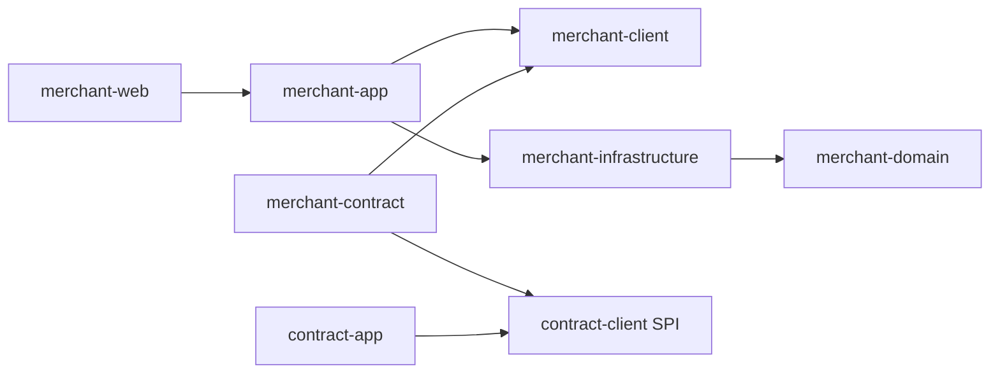

<!-- Generated by doc-sync-agent.py; sources: loadup-modules/loadup-modules-merchant/README.md, loadup-modules/loadup-modules-merchant/ARCHITECTURE.md -->

可复用的商户基本信息管理模块，为后台管理与合约签约/运行资格查询提供持久资料源。通过 COLA client/domain/infrastructure/app 分层和可选 web、contract 适配接入，商户核心不依赖合约。

## 能力矩阵

| 能力 | 当前契约 |
|---|---|
| 基本资料 | 编码、名称/简称、类型、行业、国家/省市、地址、登记号码、联系人、电话和邮箱 |
| 管理 | 创建、更新、分页、详情、启用/停用，乐观 rowVersion；编码创建后不变 |
| 隔离 | 所有 Gateway 查询/更新限制 tenant_id 与 deleted=0；租户内编码唯一 |
| 对外报文 | POST JSON、全局 result/data、WebMVC `/api`、Trace header、SpringDoc |
| 隐私 | 地址/登记号/联系方式在 WebMVC JSON 输出中脱敏；内部资料与存储不被输出掩码污染 |
| 合约接入 | 可选 merchant-contract 将持久资料转换为 MerchantFactsProvider；自定义 Provider 优先 |
| 前端 | 商户管理页面、类型化 API、签约页面选择启用商户 |
| 边界 | 基本信息登记不等于资质认证；暂无入网审核、渠道商户号、银行结算账户、门店、KYC 或文件流程 |
| 验证 | 测试源码已提供，未编译、运行或完成端到端联调 |

## Maven 与配置

引入 LoadUp BOM 后按需消费：

```xml
<!-- 本地业务服务；需要 HTTP 管理时改用 loadup-modules-merchant-web -->
<dependency>
    <groupId>io.github.loadup-cloud</groupId>
    <artifactId>loadup-modules-merchant-app</artifactId>
</dependency>
<!-- 与合约同时使用时增加事实适配 -->
<dependency>
    <groupId>io.github.loadup-cloud</groupId>
    <artifactId>loadup-modules-merchant-contract</artifactId>
</dependency>
```

商户 Java API 为 MerchantService；跨模块只需依赖 merchant-client 的 MerchantQueryFacade。contract 适配仅依赖两个 client jar，使用 MerchantQueryFacade，不依赖商户内部仓储，也不强制引入合约 app。单独部署商户服务时不引入适配 jar。

```yaml
loadup:
  modules:
    merchant:
      enabled: true
      web:
        enabled: true
  flyway:
    enabled: true
    locations: classpath:db/migration
spring:
  datasource:
    url: ${DB_URL}
    username: ${DB_USER}
    password: ${DB_PASSWORD}
```

database 组件提供共享 Clock、事务管理与 MyBatis-Flex。配置唯一/主 DataSource；合约资料读取需走主库，不能因 readOnly 标志路由到滞后的副本。Flyway 提供 `V20261010000001__create_merchant_profile.sql`。开关只控制 Bean 装配，数据库迁移须由消费工程统一规划。

租户通过可信身份入口绑定 TenantUtil/ScopedValue，JSON 不接收 tenantId/actor；本地单租户启动器沿用 database 组件的默认租户入口。多租户环境不能直接信任客户端租户头。后台权限授予租户范围管理者，商户自助访问还需要消费方增加身份归属检查。

## 管理 API

| POST 路径 | 权限 | 请求 |
|---|---|---|
| `/api/merchants/create` | merchant:write | MerchantCreateCommand |
| `/api/merchants/update` | merchant:write | 基本资料、id、expectedRowVersion |
| `/api/merchants/page` | merchant:read | merchantCode 精确匹配、name 模糊匹配、status、page/size |
| `/api/merchants/detail` | merchant:read | id |
| `/api/merchants/status` | merchant:manage | id、expectedRowVersion、ACTIVE/INACTIVE |

```json
{
  "merchantCode": "M001", "name": "示例零售商户", "shortName": "零售",
  "type": "ENTERPRISE", "industry": "RETAIL", "country": "CN", "province": "GD", "city": "SZ",
  "address": "示例地址", "registrationNo": "REG001", "contactName": "联系人",
  "contactPhone": "13800138000", "contactEmail": "merchant@example.com"
}
```

类型为 ENTERPRISE/SELF_EMPLOYED/INDIVIDUAL。编码与行业为64位以内稳定编码，国家为两位大写代码；当前仅校验格式，消费方需维护自己的行业/地区目录。phone 支持可选 + 与8～15位数字。创建默认 ACTIVE，表示允许参与业务，不表示资料审核通过。

更新必须使用最新 rowVersion，且 merchantCode 不变。**address、registrationNo、contactName、contactPhone、contactEmail 为 null/未提供时保留原值，空字符串明确清空，非空替换。** 前端不把详情中的掩码重新写回；原敏感字段仅作脱敏展示，编辑默认空白。状态变化也递增 rowVersion，冲突后重新查询再确认。

没有删除接口：商户停用后保留历史资料及合约引用。停用不是终止合约，重新启用后仍须重新通过当前运行资格判断。

HTTP 使用200 + result/data，`result.status == "S"` 为成功。MERCHANT_NOT_FOUND/MERCHANT_CONFLICT 复用全局错误报文；其余入参错误由全局 WebMVC 处理。原始敏感数据仍存于数据库，输出脱敏不是加密；生产需控制数据库权限、备份与保留期限。

## 合约使用商户资料

引入 app + merchant-contract + contract-app/web 后，自动装配默认 MerchantFactsProvider；消费方已有自定义 Provider 时适配器退让。字段为 STRING：

| 合约事实 | 来源 |
|---|---|
| merchant.code | 稳定业务编码 |
| merchant.type | 商户类型 |
| merchant.industry | 已管理的行业代码 |
| merchant.country / merchant.province / merchant.city | 地区，缺失或空白不输出 |

合约请求中的 **merchantId 是商户资料的 id，不是 merchantCode**。签约页面从已启用商户列表选择。不存在或 INACTIVE 商户返回未通过资格校验；适配器再次检查返回的 tenantId/id，且不输出联系人、地址、登记号或伪造 `merchant.verified` 等资质事实。

资料变更不会重写已签约条款快照。签约资格取资料查询时的当前值；持续资格必须定义为产品/方案使用条件，运行时每次重新读取。停用后后续新的预览/签约/运行事实读取拒绝；已经提交的签约幂等重放仍返回历史结果，不重新签约。在途并发操作的截止点由消费工程业务门禁决定，本模块不跨商户、合约事务做全局锁。

## 页面、示例与验证

前端入口 `/merchants/list`，API 位于 `frontend/apps/admin/src/api/merchant/index.ts`。合约签约页支持按名称搜索启用商户。页面按钮不替代服务端权限检查。

[Router.http](https://github.com/loadup-cloud/loadup-framework/blob/main/loadup-application/src/main/resources/Router.http) 提供先创建商户、再签约、启停与更新示例；本地 UPMS schema.sql 补三类商户权限。已有数据库需手工执行新增授权语句并重新登录，消费工程自行管理权限。

MerchantBasicInfoTest、MerchantFactsTest 和 MerchantContractIT 源码覆盖私有字段更新语义、事实白名单/未知值、身份错配、自定义 Provider 退让、MySQL 编码唯一/版本冲突/租户隔离、真实商户签约与停用门禁。集成测试使用 Testify + MySQL Testcontainers，不用 MockBean 代替数据库；未执行构建或测试。设计见 [ARCHITECTURE.md](./#architecture)。

## 业务配置命名空间

模块专属配置统一使用 `loadup.modules.merchant.*`，配置中心与消费工程需同步迁移旧前缀；应用开关为 `loadup.modules.merchant.enabled`，HTTP 开关为 `Maven *-web dependency`，默认开启。

## 统一接入契约

Java 消费方通过 `client.facade.XxxFacade` 注入公开业务入口；默认应用 Service 直接实现接口。引入 `*-app` 装配业务能力，引入 `*-web` 才提供 Controller，Web 适配不再提供独立 enabled 开关。模块整体启停仍使用 `loadup.modules.merchant.enabled`。

JSON Controller 显式返回 SuccessResponse，分页保留已有分页报文契约；异常由全局 WebMVC 处理。下载仍为流式响应。请求与 DTO 字段声明 OpenAPI，凭证只写。持久化经 database 组件使用 MyBatis-Flex、Tables 常量和 Spring MapStruct Converter；数据库连接与可信租户来源由消费工程配置。新 schema 迁移与本轮 clean 编译、运行验证仍需本地执行。

---

<a id="architecture"></a>
## 设计与实现

### 职责边界

商户是独立于 UPMS 用户、租户和合约的业务主体。UPMS 管理操作者身份与权限；Merchant 管理商户基本资料；Contract 读取资料判断签约/使用规则并冻结配置。商户 id 为内部身份，merchantCode 为租户内不可变业务编码，不能直接用 UPMS userId 或名称代替。

本轮交付基本资料 CRUD、启停、持久化、管理 API、页面和事实适配。资质核验、入网流程、渠道注册、结算账户、门店、历史资料版本与可靠审计后续按业务需求建设。

### 分层和依赖



client 为 Command/Query/DTO 和 MerchantQueryFacade；domain 为不可变 Merchant/MerchantBasicInfo、枚举与 Gateway，零 Spring/ORM/JSON；infrastructure 为 BaseDO、Mapper、GatewayImpl 和 MapStruct；app 负责事务、身份、时钟、版本及公开查询；web 负责 POST/JSON、权限和 SpringDoc。

可选 merchant-contract 只通过 MerchantQueryFacade 与 MerchantFactsProvider 桥接，不在商户核心引入合约依赖，也不在合约核心引入商户仓储。Bean 缺失时不装配，已有自定义 Provider 优先。

自动配置采用 DataSource 候选条件与显式 Import，转换器为 MapStruct 生成的 Spring Bean。没有组件扫描与 REGISTER_BEAN 条件混用，不手工创建转换器。

### 领域不变量

- 租户内 merchantCode 唯一且创建后不变，名字不作为身份。
- 名称、类型、行业、国家必填；字段长度、控制字符和联系方式在领域构造器校验，HTTP 也有 Bean Validation。
- ACTIVE/INACTIVE 表示业务启停，不表示 KYC/资质核验；创建初始 ACTIVE。
- 更新与状态命令检查 expectedRowVersion，写入条件再次检查，成功递增版本并记录 updatedBy。
- 私有字段 null 保留、空串清空；接口响应掩码不用于持久化。没有物理删除能力。

### 持久化与隔离

merchant_profile 包含 id/tenant_id/created_at/updated_at/deleted 标准列，以及基本资料、status、row_version、创建/更新操作者。唯一键 tenant_id+merchant_code；分页索引 tenant_id+status+created_at。id 由业务 UUID 提供。

Gateway 用 QueryWrapper 明确约束 tenant 与 deleted=0；空租户和空查找 id 拒绝。Mapper 只有 BaseMapper 标准方法。更新整个已合并资料时显式写入 null，以允许清空可选公开字段；敏感字段已在领域更新中保留原值或明确置空串。事务由 app 包围，唯一约束处理并发创建，版本条件防止丢失更新。

迁移 V20261010000001 与合约时间戳编号独立，消费方需验收多模块组合及已有库升级。框架提供的是 SDK，loadup-application 仅作本地集成启动器。

### 合约事实信任边界

MerchantQueryFacade 读取显式租户/id，并要求请求作用域租户一致；事实适配器再次比较返回身份，仅输出基本事实白名单。未维护的地区不输出，未知事实不能靠空串伪装成存在。联系人、登记号和详细地址不进入事实 map。

后台管理员维护的行业可用于普通产品销售限制；不能把人工登记字段当作证件核验或监管资质。需要强资质判断时消费方扩展独立可信 Provider 与审批，仍不能信任浏览器上传的 fact map。

lookup 不使用 readOnly 事务提示，要求权威主库，避免商户停用后因副本滞后继续放行。MerchantFactsProvider 查询发生在合约事务前，不跨模块持锁；在途并发采样无法等同原子停用门禁。合约运行每次读取当前事实；历史条款不因此修改。

### 接口与隐私

`/api/merchants/create/update/page/detail/status`，分别用 merchant:write/read/manage 授权，JSON 全部 POST。租户由框架可信上下文绑定，actor 来自 Authentication。权限只表示租户后台管理资格，面向商户自助时须增加数据归属控制。

DTO 用 Masked 描述 JSON 输出规则，由 WebMVC 独立输出 mapper 脱敏，不修改全局 mapper或领域数据。前端敏感编辑从空白开始，null 保留原值，避免保存掩码。资料存储仍是明文，日志禁止打印 Command/DO 原文；生产需自行设置数据库权限/加密和审计保留。

### 验证与扩展

已编写领域、事实适配与真实 MySQL 合约组合测试，未运行。后续执行 Boot 装配、MapStruct/Jackson3、实际权限、脱敏、前端类型/交互及并发停用边界验收。可靠审计、Outbox、资质审核、历史资料与渠道开户扩展不得覆盖现有合约条款。

### 公共边界与映射约束

Facade 是 client 的业务契约，应用服务直接实现；Controller 和跨模块消费者依赖 Facade。domain 保留业务状态、规则与 Gateway，表示层字段转换交给 Spring 管理的 MapStruct。共享配置固定 Spring 模式、构造器注入和目标字段严格校验。

仓储依赖 database 的固定 UUID、审计时间、逻辑删除规则，显式声明空 BaseMapper，并通过模块生成的 Tables 表达查询。字典删除与文件引用解绑明确使用物理删除；文件状态、通知归档和任务生命周期是业务状态，独立于 BaseDO 的 deleted。

所有数据对象的诊断文本使用 commons-json；诊断序列化与真实 API JSON 分离，避免因 HTTP 脱敏设置改变日志中的凭证披露规则。
