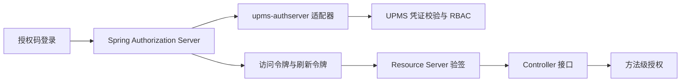

<!-- Generated by doc-sync-agent.py; sources: loadup-modules/loadup-modules-upms/README.md, loadup-modules/loadup-modules-upms/ARCHITECTURE.md -->

用户、角色、权限和部门业务模块。UPMS 校验凭证，提供角色继承的 RBAC 授权及基于资源所属人、部门的数据范围判定；令牌签发由 AuthServer 完成。

账号安全自助接口由 `loadup-modules-upms-web` 提供：`GET /api/account/security/overview` 查看本人状态，`GET /api/account/security/logins` 查看本人登录记录，`POST /api/account/security/password` 使用旧密码修改本人密码。用户 ID 从认证主体取得，不接受请求指定其他账号。新密码至少 8 字符、最多 72 个 UTF-8 字节且必须不同于旧密码。管理员的锁定与解锁接口仍在 `/api/upms/user/**`。

登录失败达到配置阈值后临时锁定；到期后的下一次登录会自动解锁。管理员手动锁定不会自动解锁。HTTP 登录记录使用服务端观察到的 IP，不信任客户端传入的转发头。当前 JWT 为无状态令牌，修改密码或锁定账号不会立即撤销已签发令牌；已有令牌可用至其到期，后续撤销机制见 Roadmap。

## 引入

```xml
<dependency>
  <groupId>io.github.loadup-cloud</groupId>
  <artifactId>loadup-modules-upms-app</artifactId>
</dependency>
```

前后端分离的用户名密码登录需引入 `loadup-modules-upms-authserver` 与 `loadup-components-authserver-binder-sas`，通过 `POST /api/auth/login` 获取 JWT。可设置 `loadup.security.auth-server.protocol-endpoints-enabled: false` 关闭 OAuth2 协议端点。

## 配置

```yaml
loadup:
  modules:
    upms:
      security:
        login:
          enable-failure-tracking: true
          max-fail-attempts: 5
          lock-duration: 30
```

`AuthenticationService.login` 是内部身份校验接口；HTTP 登录由 authserver 适配器完成。需要预置用户注册与 RBAC HTTP 接口时，再引入 `loadup-modules-upms-web`；也可以直接在应用 Controller 中调用 UPMS 服务。

业务代码注入 `AccessCheckService`，调用 `check(new AccessCheckCommand(userId, permissionCode, ownerUserId, departmentId))`。结果默认拒绝；仅当有效角色授予该权限，且该角色的数据范围匹配资源属性时放行。`@PreAuthorize` 可校验静态权限，资源级 ABAC 判定须显式调用此 API。

| 能力 | 所属模块 |
|------|----------|
| 用户凭证校验与登录策略 | `loadup-modules-upms-app` |
| 角色与权限数据 | `loadup-modules-upms-domain`、`-infrastructure` |
| RBAC + 资源属性判定 API | `loadup-modules-upms-client`、`-app` |
| 可选 HTTP Controller | `loadup-modules-upms-web` |
| SAS 用户认证适配 | `loadup-modules-upms-authserver` |
| 令牌签发与刷新 | `loadup-components-authserver-binder-sas` |
| Bearer 验签 | `loadup-components-resource-server` |
| 方法级授权 | `loadup-components-authorization` |

## 敏感数据展示与明文读取

普通 `UserDetailDTO` 的姓名、邮箱、手机号在 WebMVC JSON 输出中固定脱敏；内部对象与数据库保留原值。管理员也遵循同一展示规则。用户修改时省略敏感字段表示不变，显式空字符串表示清空；包含 `*` 的姓名、邮箱或手机号不能写入，避免把掩码保存为原数据。管理端编辑界面将这些字段留空，填写新值才更新。

`POST /api/upms/user/sensitive` 是独立明文读取入口，要求 JWT 静态 authority `upms:user:sensitive:read`，并重新执行有效角色权限与目标用户数据范围的 RBAC/ABAC 校验。请求示例：

```json
{"id":"target-user-id","purpose":"CUSTOMER_SUPPORT"}
```

purpose 只允许 `PROFILE_CORRECTION`、`CUSTOMER_SUPPORT`、`SECURITY_REVIEW`。接口没有超级管理员绕过规则；需要显式配置权限及相应角色数据范围，不自动授予现有账号。返回 `result/data`，data 只含 id、realName、email、mobile；响应为 `Cache-Control: no-store`。

明文返回前必须有 `SensitiveReadAudit` 同步持久化访问记录。消费工程显式引入 `loadup-modules-audit` 后，Web 适配器提供默认桥接，以独立事务记录 actor、目标 ID、用途、tenant 与 traceId，不记录字段原文。缺失审计组件或写入/提交失败则拒绝明文；也可提供自己的可靠 recorder。

## 业务配置命名空间

模块专属配置统一使用 `loadup.modules.upms.*`，配置中心与消费工程需同步迁移旧前缀；登录策略为 `loadup.modules.upms.security.login`，OAuth 为 `loadup.modules.upms.security.oauth`。认证协议与令牌校验继续使用全局 `loadup.security.*`。

## 统一接入契约

Java 消费方通过 `client.facade.XxxFacade` 注入公开业务入口；默认应用 Service 直接实现接口。引入 `*-app` 装配业务能力，引入 `*-web` 才提供 Controller，Web 适配不再提供独立 enabled 开关。模块整体启停仍使用 `loadup.modules.upms.enabled`。

JSON Controller 显式返回 SuccessResponse，分页保留已有分页报文契约；异常由全局 WebMVC 处理。下载仍为流式响应。请求与 DTO 字段声明 OpenAPI，凭证只写。持久化经 database 组件使用 MyBatis-Flex、Tables 常量和 Spring MapStruct Converter；数据库连接与可信租户来源由消费工程配置。新 schema 迁移与本轮 clean 编译、运行验证仍需本地执行。

---

<a id="architecture"></a>
## 设计与实现

账号安全自助读写由 `AccountSecurityController → AccountSecurityService → UserGateway/LoginLogGateway` 完成。密码修改复用 `UserService.changePassword` 的旧密码校验、编码与持久化；登录记录通过既有 `LoginLogGateway` 按本人 ID 分页读取。HTTP 层只从已验证 JWT 的 `LoadUpUser.userId` 取当前用户，不从请求读取用户 ID。`UpmsTokenController` 将服务端远端 IP 传入认证服务，成功及已知用户名的失败尝试写入登录日志。临时锁定到期后允许在认证时解锁；管理员手动锁定必须手动解除。

### 边界



UPMS 的 `AuthenticationService.login` 选择登录策略、校验账号凭证并记录登录结果，返回 `AuthenticatedUser`，不签发令牌。用户、角色、权限、部门数据仍由 UPMS 的 client/domain/infrastructure/app 分层管理。`loadup-modules-upms-authserver` 是可选适配器：`UpmsAuthenticationProvider` 使用 UPMS 登录接口，随后读取角色和权限；`UpmsTokenController` 为前端提供 `/api/auth/login` JSON 接口并签发用户 JWT。

`loadup-components-authserver-binder-sas` 管理签名密钥和 JwtEncoder；启用 OAuth2 协议端点时也管理客户端、授权码和刷新令牌。JWT 的 `sub` 是 UPMS 用户 ID；`roles`、`permissions`、`username`、`aud` 与 `token_use` 在签发时写入。资源端由独立 `loadup-components-resource-server` 校验。关闭协议端点时，资源端直接用本地公钥验签。

### 依赖方向

UPMS 领域对象、对外 DTO 和持久化对象的审计时间统一为 `createdAt`、`updatedAt`；数据库列为 `created_at`、`updated_at`，与框架 `BaseDO` 一致。

- UPMS 核心模块依赖 commons/components，不依赖 SAS 实现；可选 `upms-web` 提供 Controller。
- `loadup-modules-upms-authserver` 依赖 UPMS app 与 AuthServer API，允许应用按需引入。
- 资源服务器认证和业务授权直接作用于 Controller；外部 API 调用由未来独立的 HTTP 客户端组件承担。
- `loadup-components-authorization` 提供 `@PreAuthorize` 方法安全和 `UserContext`，不注册 HTTP 放行链。

### RBAC 与 ABAC

- **client**：`AccessCheckCommand` 和 `AccessDecisionDTO` 是跨模块契约；用户详情只保留 client 的 `UserDetailDTO`，角色/用户查询条件位于 client.query。
- **domain**：`UserPermissionService` 计算有效角色及其继承权限；`AccessDecisionService` 先核对角色授权，再按授予角色的 `DataScope` 检查资源所属人或部门。继承的权限使用授予该权限的角色的数据范围，循环角色链按已访问 ID 截断。
- **infrastructure**：`upms_user_role`、`upms_role_permission`、`upms_role_department` 是关系存储，Mapper 由 MyBatis-Flex 生成；仓储实现不承载授权决策。
- **app**：`AccessCheckService` 将 client 请求映射为领域资源属性。登录凭证、登录方式和 OAuth 提供商模型属于应用内部策略，不暴露在 client。Web 适配不公开可代填任意 userId 的判定端点，调用方须从可信身份上下文获取 userId。

数据范围编码：`1` 全部、`2` 自定义部门、`3` 本部门、`4` 本部门及下级、`5` 仅本人。范围判定所需的所属人或部门属性缺失、未知范围、无有效权限或停用用户均拒绝；“全部”范围无需所属人和部门属性。多个有效角色采用“任一完整授权放行”。该 ABAC 切片只覆盖组织与所属人属性，没有通用表达式策略或环境属性规则；这些能力需具体用例再扩展。

### 运行约束

UPMS 应用密码编码器支持新写入的 `{bcrypt}` 和已有的 BCrypt 哈希。SAS 客户端密钥经 BCrypt 编码。生产环境需配置持久 RSA 私钥；不配置时的临时私钥仅适于本地开发。资源端应使用固定 issuer、audience 和可信 JWK，公开 API 路径由 `permit-all` 明确声明。

当前刷新令牌沿用授权时保存的用户主体，角色和权限是签发时快照；需要撤销后立即生效的部署，应缩短访问令牌有效期，并在上线前实现刷新阶段的 UPMS 重新校验及授权撤销存储。

### 敏感字段与明文访问边界

`upms-client` 输出 `UserDetailDTO` 声明 `@Masked`；domain/DO/Command 不声明展示规则。`upms-app` 的 `UserSensitiveReadService` 校验调用者和请求、读取租户范围内目标、执行 `AccessDecisionService`、调用 `SensitiveReadAudit`，最后才经 Spring MapStruct `UserSensitiveConverter` 构造不带脱敏注解的 `UserSensitiveDTO`。

`upms-web` 的独立 Controller 从认证主体取得 actor，不接受客户端指定调用者；静态方法授权与 app 中最新角色/资源范围校验同时存在。purpose 为枚举，audit SPI 不接受任何敏感原文。审计模块是 web 的 optional 依赖，app/domain 无 audit 横向依赖；默认桥接仅在 AuditService 存在时装配，并以 REQUIRES_NEW 事务确保成功提交后才能返回。缺少 recorder 时普通查询继续可用，明文请求失败。

普通输出不因角色权限变成明文；明文 DTO 的 toString 只输出 ID，且响应不可缓存。调用方仍须避免记录 HTTP body、DTO JSON 或敏感字段异常。首版未提供通用明文导出，导出处理器须显式执行展示脱敏。

### 公共边界与映射约束

Facade 是 client 的业务契约，应用服务直接实现；Controller 和跨模块消费者依赖 Facade。domain 保留业务状态、规则与 Gateway，表示层字段转换交给 Spring 管理的 MapStruct。共享配置固定 Spring 模式、构造器注入和目标字段严格校验。

仓储依赖 database 的固定 UUID、审计时间、逻辑删除规则，显式声明空 BaseMapper，并通过模块生成的 Tables 表达查询。字典删除与文件引用解绑明确使用物理删除；文件状态、通知归档和任务生命周期是业务状态，独立于 BaseDO 的 deleted。

所有数据对象的诊断文本使用 commons-json；诊断序列化与真实 API JSON 分离，避免因 HTTP 脱敏设置改变日志中的凭证披露规则。
